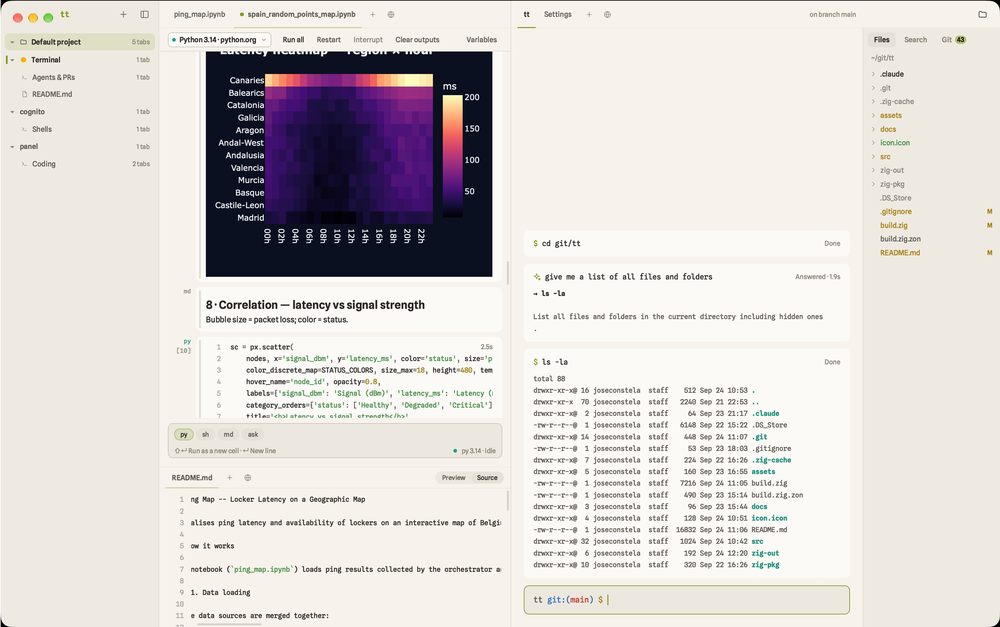

<p align="center">
  
</p>

<h1 align="center">tt</h1>

<p align="center">
  A calm, block-based ide/browser/terminal for macOS.<br>
  Written in Zig, drawn with Metal, running your real shell.
</p>

<p align="center">
  <a href="#getting-started">Getting started</a> ·
  <a href="#features">Features</a> ·
  <a href="#keyboard">Keyboard</a> ·
  <a href="#what-stays-local-and-what-does-not">What stays local</a> ·
  <a href="#how-it-works">How it works</a> ·
  <a href="#extending">Extending</a>
</p>

---

No Electron, no Swift, no Objective-C sources: AppKit, Metal,
CoreText, WebKit, AVFoundation and others are driven straight from Zig through the Objective-C runtime.

## Features

- **Local only.** (except for external AI agents & Apple's voice recognition if you decide to use it). Your shell, your files, your projects and your
  settings never leave this Mac. There is no account, no sync, no telemetry, no update check. The
  only thing that ever goes out is what you choose to send to an AI agent you configured yourself,
  and with a local model (Ollama) not even that. Nothing is configured out of the box.
  [The full list is below.](#what-stays-local-and-what-does-not)
- **Block-based terminal,** yet compatible with AI agents. Built in support for "fix with agent", explain, etc.
- **An input box, not a prompt.** You can enter both commands or plain text asking for a commant to run.
- **Projects.** Add a folder to the sidebar and it becomes a project with tabs of its own. Arrange tabs, split and arrange them, pin files, and others.
- **Native contents.** Obsidian-style as Markdown editor whose preview stays editable (tables in cells,
  inline HTML and entities rendered), image, PDFs rendered
  page by page.
- **Native Notebooks.** Native ZeroMQ python notbook support for `.ipynb` files with kernel selection and built-in AI helpers. All ourput formats supported (native or HTML rendered via WebKit).
- **Websites.** Fully capable builtin browser, with basic privacy rules, support for webcam, microphone interactions, etc.
- **Full-screen programs.** vim, htop, less, fzf, ssh, REPLs and Claude Code take over the whole
  tab on Ghostty's terminal core and hand it back when they exit.
- **⌘K.** A fully featured command palette over commands, open tabs, shell history, goto file, etc. 
- **Styles: tt's own, E-ink, and classic terminal themes.** Plus most common themes. Configurable per-monitor.
- **Physical world interactions.** Blurr the screen when looking away, control with your voice, etc.

## Getting started

Requirements: macOS, [Zig 0.16](https://ziglang.org/download/) and the Xcode command line tools (`zig build app` also needs Xcode itself, whose `actool` compiles the app icon).

```sh
git clone git@github.com:lab34-es/tt.git
cd tt
zig build run                     # build and launch
```

Other targets:

```sh
zig build app                     # zig-out/tt.app, ready for /Applications
zig build test                    # unit tests for the pure-logic modules
zig build -Doptimize=ReleaseFast  # optimised binary
```

The first build fetches tt's one dependency, [libghostty-vt](https://github.com/ghostty-org/ghostty),
pinned by commit in `build.zig.zon` (about 130 MB unpacked into the git-ignored `zig-pkg/`). If that
first fetch errors out, run `zig build` again.

## What stays local

tt keeps its state in three plain files in your home directory, and nowhere else:

| File | Holds |
| --- | --- |
| `~/.tt/config.yml` | Style, accent, a style per display, the model APIs you added (name, provider, model, key, base URL), which features use them, notebook options |
| `~/.tt_projects` | Your projects, their pinned files and shell groups |
| `~/.tt_workspace` | Open tabs, pane layout, each shell's directory and its blocks, each notebook's outputs |

The config file is readable YAML meant to be edited by hand. It also holds your API keys in the
clear, so treat it like any other credentials file.

There is no crash reporter, no usage ping and no "check for updates".

## How it works (the basics)

**Blocks from a real shell.** `assets/shell/tt.zsh` installs a `preexec` and a `precmd` hook that
print invisible marks (the OSC 133 convention other terminals use): output starts, finished with
status N, plus the cwd and git branch. The session keeps only what arrives between the marks, so
the prompt and zsh's line editor never show up; tt has its own input box. Your dotfiles are not
modified: a private `ZDOTDIR` sources them first and is restored afterwards. A third hook,
`command_not_found_handler`, marks the block so the agent feature can take it over.

**One draw call.** The UI is immediate-mode. Each frame becomes one instanced Metal draw (plus
one per distinct image on screen) of rounded-rect SDFs, atlas-sampled glyphs and textured quads.
CoreText shapes the text with glyph fallback for any script, and box-drawing characters are drawn
as rectangles that fill their cells exactly. The fonts, Spline Sans and Spline Sans Mono, are
embedded in the binary.

**Full-screen programs.** When a program switches to the alternate screen or puts the tty in raw
mode, the session hands the tab to libghostty-vt behind a small seam (`src/term/screen.zig`) and
takes it back when the program exits; the final screen becomes the block's output.

**Notebooks through Jupyter.** A notebook tab does not speak ZeroMQ itself: it starts
`assets/notebook/tt_jupyter.py` with the notebook's Python, and that script starts the kernel with
jupyter_client, the library Jupyter Lab and VS Code use, and relays the messages as one JSON line
each over pipes. tt keeps the frontend: cells are its own editor and Markdown view, outputs go
through the block buffer, pictures through the image path. Every kernel installed for that Python
works, and the file stays plain nbformat 4.

**Tabs are a vtable.** A tab kind is a struct with a label, `create`, `deinit` and `draw`, turned
into pointer + vtable at comptime (the shape of `std.mem.Allocator`) and registered with the tab
manager. Viewers add one function that says whether they want a file.

## Testing

```sh
zig build test                        # unit tests
./zig-out/bin/tt --script demo.tt     # headless: real shell, real rendering, PNG snapshots
./zig-out/bin/tt --probe 'ls'         # pty + shell integration only, prints the blocks as text
```

The script language (type, click, drag, open, split, snap…) is documented at the top of
`src/script.zig`. A notebook opened from a script runs for real too, given a Python with
`ipykernel`; `TT_DEBUG_EVENTS=1` prints what the kernel sends.

## Status

Early and moving fast.

Built on [libghostty-vt](https://github.com/ghostty-org/ghostty) for terminal emulation.

## License

MIT, see [LICENSE](LICENSE). That file also lists the third-party software tt bundles or uses,
with their licenses.
