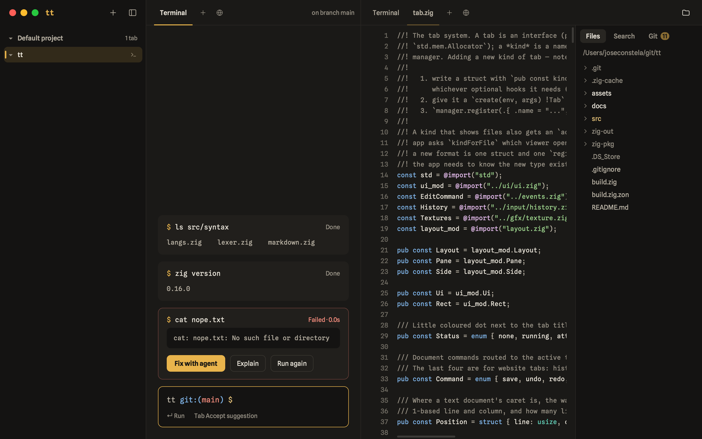

<p align="center">
  
</p>

<h1 align="center">tt</h1>

<p align="center">
  A calm, block-based terminal for macOS.<br>
  Written in Zig, drawn with Metal, running your real shell.
</p>

<p align="center">
  <a href="#getting-started">Getting started</a> ·
  <a href="#features">Features</a> ·
  <a href="#keyboard">Keyboard</a> ·
  <a href="#what-stays-local-and-what-does-not">What stays local</a> ·
  <a href="#how-it-works">How it works</a> ·
  <a href="#extending">Extending</a>
</p>

---

tt treats every command as a **block**: the command, its output, how long it took and whether it
failed, in one card you can collapse, copy or run again. Around the shell sit the things you reach
for while you work: the files of the project, a real text editor, Markdown notes, Jupyter notebooks,
images and PDFs, a browser tab, git. All of it in one window that comes back exactly as you left it when you relaunch.

It is a single native binary. No Electron, no Swift, no Objective-C sources: AppKit, Metal,
CoreText and WebKit are driven straight from Zig through the Objective-C runtime.

## Features

- **Local only (except for external AI agents).** Your shell, your files, your projects and your
  settings never leave this Mac. There is no account, no sync, no telemetry, no update check. The
  only thing that ever goes out is what you choose to send to an AI agent you configured yourself,
  and with a local model (Ollama) not even that. Nothing is configured out of the box.
  [The full list is below.](#what-stays-local-and-what-does-not)
- **Blocks instead of a scrollback.** Live status and duration per command, ANSI colours
  (16 / 256 / true colour), `\r` progress bars and cursor-up redraws, soft wrapping that reflows
  with the window, long output folded, text selection, *Copy output* and *Run again*. A failed
  command gets a red outline and its own action row.
- **Your real shell.** tt runs your zsh with your dotfiles, aliases, functions, `cd` state and
  environment. Two shell hooks mark where a command starts and ends; nothing else is touched.
- **An input box, not a prompt.** Caret and selection, your Cocoa key bindings, IME and dead keys,
  multi-line with ⇧↵, history with ↑/↓ and fish-style ghost suggestions from history and from the
  filesystem (Tab accepts). While a program runs, the box feeds its stdin.
- **Projects.** Add a folder to the sidebar and it becomes a project with tabs of its own, plus
  shell groups and pinned files underneath. Click a project and a shell starts in its folder.
- **A files panel with three views.** The current directory as a live tree with git status
  colours and the usual menus (new, rename, delete to Trash, reveal, open with…, drag and drop);
  find-in-files with match case, whole word, regex and replace; and a git view to stage, commit,
  discard, fetch, pull, push and switch branches.
- **Split panes.** Drag a tab to a pane's edge to split it (or ⌘D / ⌘⇧D), between strips to move
  it, or drop a file from the panel straight into a pane. The same model as VS Code's editor groups.
- **Files open in place.** A real text editor (undo, IME, auto-indent, syntax colours for
  27 languages), an Obsidian-style Markdown editor whose preview stays editable (tables in cells,
  inline HTML and entities rendered), images with EXIF rotation and 1:1 zoom, and PDFs rendered
  page by page. Viewers pick the file by its bytes first
  and its extension second, so a renamed PNG still opens as a picture.
- **Notebooks.** A `.ipynb` opens as a column of cells run by a real Jupyter kernel: the Python of
  the nearest `.venv`, else one that has `ipykernel`. Outputs are drawn natively (coloured text,
  tracebacks, PNG figures, DataFrames as tables), `input()` works, and a `%%sh` cell is a shell
  block. New cells are typed into the input row at the bottom (py / sh / md / ask) and ⇧↵ runs
  them; the *ask* kind puts the notebook in front of your agent, which answers under the question
  and can draft a cell for you to run. A Variables panel lists the kernel's names, types and
  memory. The bar at the left edge of a cell's input or outputs folds it, as in Jupyter Lab, and
  the fold is saved the way Jupyter saves it. Files are nbformat 4, written as Jupyter writes them.
- **Websites.** A tab with an address bar and the system WebKit behind it (⌘⇧N), *Inspect
  Element*, and a context menu that sends the selected text to the shell.
- **Full-screen programs.** vim, htop, less, fzf, ssh, REPLs and Claude Code take over the whole
  tab on Ghostty's terminal core and hand it back when they exit.
- **Ask an agent (opt-in).** Pick a model under *Settings › AI* and a line the shell does not know
  (`how big is this folder`) becomes a question, with the tab's recent commands and output as
  context. The agent can propose a command; it lands in the input box for you to run, never runs
  on its own. A failed block gets **Explain** and **Fix with agent**, which launches the coding
  agent installed on your Mac (Claude Code, Codex, Gemini CLI, OpenCode, Copilot CLI, Cursor
  Agent, Aider or Goose) inside your shell.
- **⌘K and ⌘P.** A command palette over commands, open tabs, shell history and the accent colour,
  and a quick-open over every file of the workspace with `name:line:col`.
- **Everything survives a relaunch.** Tabs, panes and their sizes, focus, each shell's directory
  and its blocks come back where they were.
- **Dark, Light, System and E-ink.** Four modes and an accent of your choice. E-ink is pure black on
  white with no colour and no blinking, for e-paper displays. Each display can have a mode of its
  own (*Settings › Mode › Per screen*): the window switches when you move it there, and only tt
  changes, never macOS.

## Getting started

Requirements: macOS, [Zig 0.16](https://ziglang.org/download/) and the Xcode command line tools.

```sh
git clone git@github.com:lab34-es/tt.git
cd tt
zig build run                     # build and launch
```

Other targets:

```sh
zig build app                     # zig-out/tt.app, ready for /Applications
zig build test                    # unit tests for the pure-logic modules
zig build -Doptimize=ReleaseFast  # optimised binary
```

The first build fetches tt's one dependency, [libghostty-vt](https://github.com/ghostty-org/ghostty),
pinned by commit in `build.zig.zon` (about 130 MB unpacked into the git-ignored `zig-pkg/`). If that
first fetch errors out, run `zig build` again.

## Keyboard

| Keys | Action |
| --- | --- |
| ⌘T · ⌘N · ⌘⇧N | New terminal tab · new empty tab · new website tab |
| ⌘W | Close tab |
| ⌘1–9 · ⌘⇧[ ⌘⇧] · ⌃Tab | Switch tabs |
| ⌘D · ⌘⇧D | Split right · split down |
| ⌘[ · ⌘] | Focus previous · next pane |
| ⌘K | Command palette |
| ⌘P | Go to file |
| ⌘⇧F | Find in files |
| ⌘B · ⌘⇧E | Toggle sidebar · files panel |
| ⌘⇧O | Add a folder as a project |
| ⌘E | Markdown: preview ⇄ source · Notebook: variables & kernel panel |
| ⇧↵ | Notebook: run the cell and move on · input row: run the text as a new cell |
| ⌘S | Save |
| ⌃L | Clear blocks |
| ⌘L · ⌘R · ⌘← ⌘→ | Website tab: open location · reload · back, forward |
| ⌘, | Settings |

Every command is also in the palette, with its shortcut next to it.

## What stays local, and what does not

tt keeps its state in three plain files in your home directory, and nowhere else:

| File | Holds |
| --- | --- |
| `~/.tt/config.yml` | Mode, accent, a mode per display, the model APIs you added (name, provider, model, key, base URL), which features use them, notebook options |
| `~/.tt_projects` | Your projects, their pinned files and shell groups |
| `~/.tt_workspace` | Open tabs, pane layout, each shell's directory and its blocks, each notebook's outputs |

The config file is readable YAML meant to be edited by hand. It also holds your API keys in the
clear, so treat it like any other credentials file.

This is everything that talks to the network:

- **AI agents you set up.** Anthropic, OpenAI, Google, Mistral, Ollama on localhost, or any
  OpenAI-compatible endpoint. tt contacts them only when you ask: a plain-English line in the
  input box, *Explain* on a failed block, or an *ask* cell in a notebook. What it sends is your
  question plus the tab's transcript (recent commands, the last lines of their output, exit
  codes; for a notebook its cells, the last lines of their outputs and, unless you switch it off,
  the names and types of the kernel's variables, never their values). A fresh install has no agent
  and makes no requests.
- **Notebook kernels.** A `.ipynb` runs in a Jupyter kernel started on this Mac with the
  notebook's own Python. The Jupyter protocol between tt and that kernel runs over sockets bound
  to 127.0.0.1, as it does under Jupyter Lab; nothing leaves the machine.
- **Website tabs.** The pages you open, through the system WebKit, as Safari would load them.
- **Coding agents.** *Fix with agent* launches a tool that is already installed on your Mac inside
  your shell. What that tool does online is between you and it.
- **`zig build`** fetches libghostty-vt once.

There is no crash reporter, no usage ping and no "check for updates".

## How it works

**Blocks from a real shell.** `assets/shell/tt.zsh` installs a `preexec` and a `precmd` hook that
print invisible marks (the OSC 133 convention other terminals use): output starts, finished with
status N, plus the cwd and git branch. The session keeps only what arrives between the marks, so
the prompt and zsh's line editor never show up; tt has its own input box. Your dotfiles are not
modified: a private `ZDOTDIR` sources them first and is restored afterwards. A third hook,
`command_not_found_handler`, marks the block so the agent feature can take it over.

**One draw call.** The UI is immediate-mode. Each frame becomes one instanced Metal draw (plus
one per distinct image on screen) of rounded-rect SDFs, atlas-sampled glyphs and textured quads.
CoreText shapes the text with glyph fallback for any script, and box-drawing characters are drawn
as rectangles that fill their cells exactly. The fonts, Spline Sans and Spline Sans Mono, are
embedded in the binary.

**Full-screen programs.** When a program switches to the alternate screen or puts the tty in raw
mode, the session hands the tab to libghostty-vt behind a small seam (`src/term/screen.zig`) and
takes it back when the program exits; the final screen becomes the block's output.

**Notebooks through Jupyter.** A notebook tab does not speak ZeroMQ itself: it starts
`assets/notebook/tt_jupyter.py` with the notebook's Python, and that script starts the kernel with
jupyter_client, the library Jupyter Lab and VS Code use, and relays the messages as one JSON line
each over pipes. tt keeps the frontend: cells are its own editor and Markdown view, outputs go
through the block buffer, pictures through the image path. Every kernel installed for that Python
works, and the file stays plain nbformat 4.

**Tabs are a vtable.** A tab kind is a struct with a label, `create`, `deinit` and `draw`, turned
into pointer + vtable at comptime (the shape of `std.mem.Allocator`) and registered with the tab
manager. Viewers add one function that says whether they want a file.

### Source map

```
src/
  main.zig             entry point and CLI flags (--script, --probe)
  app.zig              platform-neutral core: layout, event routing, frames
  platform/cocoa.zig   NSApplication, window, Metal layer, menus, IME, hosted WebKit views
  gfx/                 renderer, shaders, text atlas, icons, images, textures
  ui/                  theme, sidebar, tab strips, panes, palette, files / search / git panels
  tabs/                the tab kinds: terminal, text editor, Markdown, notebook, image, PDF, website, settings
  notebook/            nbformat reader/writer and the Jupyter kernel behind a notebook tab
  term/                pty, VT parser, block buffer, session, the libghostty-vt seam, shell integration
  input/               editor model, history, path suggestions
  syntax/              per-line lexers for 27 languages and Markdown
  agent.zig            requests to the model APIs, streamed replies, the propose_command tool
  coding_agents.zig    which coding agents are installed and how to launch them
  config.zig · projects.zig · workspace.zig   the three files under ~
assets/
  fonts/               Spline Sans + Spline Sans Mono (SIL Open Font License)
  shell/tt.zsh         the block-mark hooks
  notebook/tt_jupyter.py  the Jupyter bridge: starts a kernel with jupyter_client, JSON lines over pipes
```

## Extending

**A new kind of tab** is any struct with `kind_label`, `create`, `deinit` and `draw`; every other
hook (`title`, `status`, `tick`, `onText`, `copy`, `paste`, `save`…) has a default:

```zig
pub const SqliteTab = struct {
    pub const kind_label = "SQLite";
    pub fn create(env: *tab.Env, args: tab.OpenArgs) anyerror!tab.Tab { ... return tab.Tab.from(SqliteTab, self); }
    pub fn deinit(self: *SqliteTab) void { ... }
    pub fn draw(self: *SqliteTab, ui: *Ui, rect: Rect, focused: bool) void { ... }
};

// app.zig
self.tabs.register(.{ .name = "sqlite", .label = "SQLite", .create = SqliteTab.create });
_ = try self.tabs.openWith("sqlite", .{ .path = "/some/file.db" });
```

The notebook tab (`src/tabs/notebook_tab.zig`) is exactly this shape, with a kernel process behind it.

**A viewer for another file format** is a tab kind with one more function, `accepts(path, head)`,
judged on the file's path and first kilobyte. Kinds are asked in registration order and the first
taker wins, so register it before the plain text editor, which accepts everything:

```zig
pub fn accepts(path: []const u8, head: []const u8) bool {
    return std.mem.startsWith(u8, head, "SQLite format 3\x00") or filetype.hasExtension(path, &.{ "db", "sqlite" });
}

// app.zig, before the "file" kind
self.tabs.register(.{ .name = "sqlite", .label = "SQLite", .create = SqliteTab.create, .accepts = SqliteTab.accepts });
```

`src/tabs/viewer.zig` has the chrome viewers share, and `src/filetype.zig` the magic numbers, so a
format's signature is written once.

## Testing

```sh
zig build test                        # unit tests
./zig-out/bin/tt --script demo.tt     # headless: real shell, real rendering, PNG snapshots
./zig-out/bin/tt --probe 'ls'         # pty + shell integration only, prints the blocks as text
```

The script language (type, click, drag, open, split, snap…) is documented at the top of
`src/script.zig`. The screenshot at the top of this page was rendered that way. A notebook opened
from a script runs for real too, given a Python with `ipykernel`; `TT_DEBUG_EVENTS=1` prints what
the kernel sends.

## Status

Early and moving fast: version 0.1.0, macOS only. Settings › AI › MCPs is a placeholder for now.

Built on [libghostty-vt](https://github.com/ghostty-org/ghostty) for terminal emulation and
[Spline Sans](https://github.com/SorkinType/SplineSans) for type.
